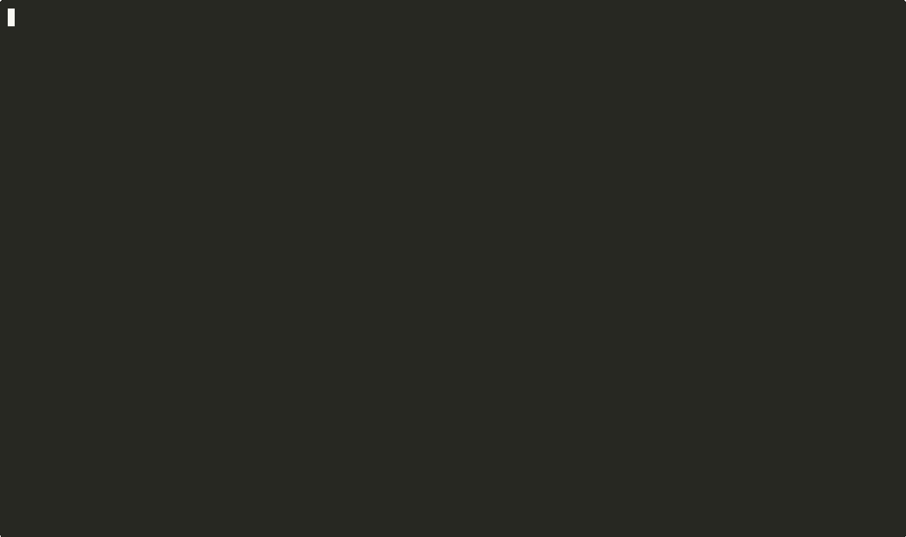

# 🐍 Ouroboros

**Security that attacks itself until nothing can.**

[](https://go.dev)
[](LICENSE)
[](https://github.com/borntobeyours/ouroboros)

AI-powered security scanner with adversarial Red/Blue AI loops. Red AI attacks, Blue AI defends, repeat until nothing breaks. Every finding includes real HTTP evidence, CVSS scores, and exploit proof — not theoretical speculation.

<p align="center">
  
</p>

```
┌─────────┐     findings      ┌──────────┐
│  Red AI  │ ───────────────► │  Blue AI  │
│ (Attack) │                  │ (Defend)  │
└─────────┘ ◄─────────────── └──────────┘
                patches
        ↻ Loop until convergence
```

## Quick Start

```bash
# Install
go install github.com/borntobeyours/ouroboros/cmd/ouroboros@latest

# Scan a target
export OPENAI_API_KEY=sk-...  # or ANTHROPIC_API_KEY
ouroboros scan http://target.com

# Scan profiles (recommended)
ouroboros scan http://target.com --profile quick      # 1 loop, fast check
ouroboros scan http://target.com --profile deep       # 3 loops, standard pentest
ouroboros scan http://target.com --profile paranoid   # 5 loops + Final Boss

# Export reports
ouroboros scan http://target.com -o report.html       # Interactive HTML
ouroboros scan http://target.com -o report.sarif      # GitHub Code Scanning
ouroboros scan http://target.com -o report.md         # Markdown
ouroboros scan http://target.com -o report.json       # JSON

# Zero-cost scanning with Claude Max subscription
ouroboros scan http://target.com --provider claude-code --model sonnet

# Authenticated scanning
ouroboros scan http://target.com --auth-user admin --auth-pass password
ouroboros scan http://target.com --auth-token eyJhbG...

# Real-time AI reasoning output
ouroboros scan http://target.com --verbose
```

## Scan Modes

Each loop is a full **Crawl → Attack → Defend** cycle. Later loops attack the patches from earlier loops, finding bypasses and new vectors that earlier loops missed.

| Profile | Loops | Final Boss | Best For |
|---------|-------|-----------|---------|
| `--profile quick` | 1 | No | CI/CD gate, fast check |
| `--profile deep` (default) | 3 | No | Standard pentest |
| `--profile paranoid` | 5 | Yes | Maximum coverage |
| `--max-loops N` | N | opt-in | Custom depth |

```bash
# Custom: 4 loops with Final Boss
ouroboros scan http://target.com --max-loops 4 --final-boss

# CI/CD: quick check, fail on high severity
ouroboros ci http://target.com --fail-on high --max-loops 2
```

## 6 Scan Phases

Every scan runs through up to six phases per loop:

```
Phase 0: RECON       Port scan, tech fingerprint, JS extraction, Wayback mining, param discovery
Phase 1: CRAWL       SPA-aware endpoint discovery and classification
Phase 2: AUTH        Auto-login, CSRF token extraction, session persistence
Phase 3: ATTACK      Red AI + 11 active probers (parallel)
Phase 4: DEFEND      Blue AI concurrent batch analysis + patch generation
Phase 5: BOSS        Final Boss exploit chaining — paranoid mode only
```

**Phase 0 (Recon)** runs once before the loop. Auto-enabled for domain targets, disabled for localhost/IP.

**Phase 5 (Boss)** runs once after all loops. Validates findings (removes false positives) and chains exploits to find new critical issues.

## What Makes Ouroboros Different

| Feature | Traditional Scanners | Ouroboros |
|---------|---------------------|-----------|
| Detection | Pattern matching | AI-guided + 11 active probers |
| Validation | "Might be vulnerable" | Actual exploitation with proof |
| False positives | Tons of noise | Confidence scoring (0-100) auto-filters |
| Severity | Static CVSS lookup | Dynamic CVSS 3.1 based on actual evidence |
| .git exposed | "File found" | Full exploit: branch, commit hash, git-dumper PoC |
| .env exposed | "File found" | Extracts actual secrets (masked in report) |
| Output | Wall of text | Sorted by CVSS, filterable, interactive HTML |
| CI/CD | Separate tool | Built-in `ouroboros ci` with exit codes |
| Remediation tracking | Manual | `ouroboros diff` — fixed vs new vs persistent |

## Features

### Scanning
- **11 Active Probers** — SQLi, XSS, IDOR, XXE, auth bypass, path traversal, file upload, SSRF, injection, headers, crypto
- **AI-Guided Exploitation** — Multi-step exploit plans with adaptive retry
- **Auto-Exploit Chains** — .git dump (branch→commit→objects→PoC), .env secret extraction
- **SPA-Aware Crawler** — Fingerprints base URL, eliminates SPA catch-all false positives
- **Same-Origin Enforcement** — Only crawls target domain, skips external links
- **Self-Learning Memory** — SQLite-backed playbook of successful techniques

### Authenticated Scanning

Ouroboros can authenticate before scanning, discovering +33% more findings on average.

```bash
# Form/JSON login (auto-detected)
ouroboros scan http://target.com --auth-user admin --auth-pass secret

# Custom login URL
ouroboros scan http://target.com --auth-user admin --auth-pass secret \
  --auth-url http://target.com/api/auth/login --auth-method json

# Bearer token
ouroboros scan http://target.com --auth-token eyJhbGciOiJIUzI1NiJ9...

# Custom headers and cookies (repeatable)
ouroboros scan http://target.com \
  --auth-header "X-API-Key: abc123" \
  --auth-cookie "session=xyz789"
```

- Auto-detects login forms and CSRF tokens
- Supports form, JSON, bearer, cookie, and header auth
- Session persists across all loops — mid-scan re-auth on token expiry
- Tested auth: +86% findings vs unauthenticated on complex apps

### Recon Module

Automatically maps the full attack surface before the first loop.

```bash
# Recon auto-enabled for domain targets
ouroboros scan http://target.com

# Force-enable or disable
ouroboros scan http://target.com --recon          # force on
ouroboros scan http://target.com --no-recon       # force off

# Select specific modules
ouroboros scan http://target.com --recon-modules portscan,jsextract,wayback
```

Available modules:
- **portscan** — Pure Go TCP connect scan with banner grabbing
- **techfp** — Technology fingerprinting via headers, cookies, body patterns
- **jsextract** — JavaScript endpoint and secret extraction (LinkFinder-style)
- **wayback** — Wayback Machine URL mining via CDX API
- **params** — Parameter discovery with reflection detection

Recon results feed directly into the attack loop — discovered URLs and parameters become crawl seeds for Red AI.

### Quality
- **Confidence Scoring** — Each finding scored 0-100: Proven (95+), High (75+), Medium (50+), Low (<50)
- **CVSS v3.1 Auto-Scoring** — Full base score with vector string, calculated from evidence
- **Severity Auto-Adjustment** — Low-confidence findings automatically downgraded
- **Smart Filtering** — `--min-confidence 50 --min-cvss 4.0` removes noise instantly

### Reports
- **HTML** — Dark theme, severity chart, filter buttons, collapsible findings, CWE links
- **SARIF** — GitHub Code Scanning compatible
- **Markdown** — Clean, readable, shareable
- **JSON** — Machine-readable for automation
- **Sorted** — `--sort cvss` (default), `--sort confidence`, `--sort severity`

### Verbose Mode

See real-time AI reasoning during the scan:

```bash
ouroboros scan http://target.com --verbose
```

Output:
```
  [RECON] Port 3000/tcp open (Express/4.17.1)
  [RECON] Found 64 JS endpoints
  [AUTH] Authentication successful (method: form, CSRF token extracted)
  [RED] Crawling target... discovered 47 URLs
  [RED] Phase 2: Running technique-specific probers...
  [RED] Probers found 12 findings
  [RED] Phase 4: AI-guided active exploitation (8 AI targets)...
  [RED] Exploitation complete: 6/8 AI findings confirmed
  [RED] Confidence: 5 proven, 4 high, 3 medium, 2 low
  [BLUE] Analyzing 12 findings in 2 concurrent batches (max 3 parallel)...
  [BLUE] Batch 1/2 done: 9 patches
  [BLUE] Batch 2/2 done: 6 patches
  [BLUE] Generated 15 patches (2/2 batches succeeded)
```

Without `--verbose`, Ouroboros still surfaces critical events (auth status, confidence summaries) while keeping output clean.

### CI/CD
```bash
# Fail build on high+ severity findings
ouroboros ci http://staging.example.com --fail-on high

# Only fail on NEW findings (ignore known issues)
ouroboros ci http://staging.example.com --fail-on high --baseline <session-id>

# Output SARIF for GitHub Security tab
ouroboros ci http://staging.example.com -o results.sarif
```

Exit codes: `0` = passed, `1` = findings above threshold, `2` = scan error

### Remediation Tracking
```bash
# Compare two scans
ouroboros diff --before abc123 --after def456

# Output:
# ✅ Fixed:      5
# ⚠️  Persistent: 12
# 🆕 New:        2

# Export diff report
ouroboros diff --before abc123 --after def456 -o progress.html
```

### Other
- **Session Prefix Matching** — `ouroboros report --session abc1` (no need for full UUID)
- **Real-Time Progress** — Animated spinner showing current phase and elapsed time
- **Rate Limiting** — `--rate 10` caps requests per second (default: 10)

## Real-World Results

### OWASP Juice Shop — Default (3 loops)
```
Findings: 64 | Confirmed: 62 (96.9%) | Duration: 3m25s
Critical: 6 | High: 24 | Medium: 24 | Low: 8 | Info: 2
```
- SQLi Login Bypass → admin JWT token (CVSS 9.1, Proven)
- UNION SQLi → full database dump (CVSS 9.1, Proven)
- Unrestricted File Upload → RCE potential (CVSS 9.8)
- IDOR → access any user's cards, orders, profile (CVSS 6.5)

### OWASP Juice Shop — Paranoid (5 loops + Final Boss)
```
Findings: 47 | Proven: 42 (89%) | Duration: 1h37m | Critical: 17
```

### OWASP Juice Shop — Authenticated vs Unauthenticated
```
Authenticated:    56 findings
Unauthenticated:  30 findings
Delta:           +86% more findings with auth
```

### DVWA (PHP)
```
Findings: 19 | Confirmed: 15 (78.9%) | Duration: 1m31s
Critical: 3 | High: 4 | Medium: 7 | Low: 4 | Info: 1
```

### WordPress
```
Findings: 39 → 16 with --min-confidence 50 --min-cvss 4.0
XXE xmlrpc.php, CORS reflection, file upload, user enumeration
```

### Live Target (asset.retas.id)
```
Git Repository Exposed — Source Code Extractable
CVSS: 8.2 (Critical) | Confidence: Proven (95%)
Branch: master | Commit: e7188b26
PoC: git-dumper https://asset.retas.id/.git/ ./dumped-repo
```

## AI Providers

```bash
ouroboros scan http://target --provider openai --model gpt-4o          # Best results
ouroboros scan http://target --provider anthropic --model claude-sonnet-4-20250514  # Alternative
ouroboros scan http://target --provider ollama --model llama3           # Free, local

# Zero cost — uses Claude Max subscription via CLI (no API key needed)
ouroboros scan http://target --provider claude-code --model sonnet
```

The `claude-code` provider uses the `claude` CLI binary. Blue AI runs in concurrent batches (3 parallel) and `--skip-blue` is auto-enabled to avoid context conflicts. Requires a Claude Max subscription.

## GitHub Action

```yaml
# .github/workflows/security.yml
name: Security Scan
on: [pull_request]

jobs:
  scan:
    runs-on: ubuntu-latest
    steps:
      - uses: actions/checkout@v4
      - uses: actions/setup-go@v5
        with: { go-version: '1.22' }
      - run: go install github.com/borntobeyours/ouroboros/cmd/ouroboros@latest
      - run: ouroboros ci ${{ env.TARGET_URL }} --fail-on high -o results.sarif
        env:
          OPENAI_API_KEY: ${{ secrets.OPENAI_API_KEY }}
      - uses: github/codeql-action/upload-sarif@v3
        if: always()
        with: { sarif_file: results.sarif }
```

See [`.github/workflows/ouroboros.yml`](.github/workflows/ouroboros.yml) for a complete example.

## Architecture

```
cmd/ouroboros/           CLI (scan, report, diff, ci, recon)
internal/
  ai/                   Provider abstraction (OpenAI, Anthropic, Ollama, Claude Code)
    claudecode.go       Claude Code CLI provider (no API key, Claude Max)
  red/                  Red AI agent
    probers/            11 technique-specific probers
    confidence.go       Confidence scoring engine
    crawler.go          SPA-aware web crawler
    classifier.go       Endpoint auto-classification
    active_exploit.go   AI-guided multi-step exploitation
  blue/                 Blue AI agent (concurrent batch patch generation)
  boss/                 Final Boss validation + exploit chaining
  auth/                 Authentication (form, JSON, bearer, cookie, header, CSRF)
  recon/                Reconnaissance (portscan, techfp, jsextract, wayback, params)
  engine/               Loop orchestration + convergence detection
  memory/               SQLite persistent store
  report/               HTML, Markdown, JSON, SARIF exporters + progress display
pkg/types/
  finding.go            Finding with confidence + CVSS
  cvss.go               CVSS v3.1 calculator
  severity.go           Severity types + parsing
  target.go             Target, ScanConfig, AuthConfig, ReconConfig
```

## Roadmap

- [x] 11 active probers with real HTTP evidence
- [x] AI-guided exploitation
- [x] Confidence scoring (0-100)
- [x] CVSS v3.1 auto-calculation
- [x] Auto-exploit chains (.git, .env)
- [x] HTML/SARIF/Markdown/JSON reports
- [x] Scan profiles (quick/deep/paranoid)
- [x] CI/CD mode with exit codes
- [x] Diff mode (fixed/persistent/new)
- [x] GitHub Action
- [x] Real-time progress display + verbose mode
- [x] Final Boss exploit chaining
- [x] Subdomain enumeration (`ouroboros recon`)
- [x] Recon module (portscan, techfp, jsextract, wayback, params)
- [x] Authenticated scanning (form, JSON, bearer, cookie, CSRF)
- [x] Claude Code provider (zero cost, Claude Max)
- [ ] SSRF exploitation (cloud metadata)
- [ ] Path traversal auto-exploit
- [ ] Web dashboard
- [ ] Rate limiting / stealth mode
- [ ] Plugin system for custom probers

## License

Apache 2.0 — see [LICENSE](LICENSE)

## Contributing

See [CONTRIBUTING.md](CONTRIBUTING.md) for guidelines.

---

*The serpent that eats its own tail. The more it attacks, the stronger it becomes.*
